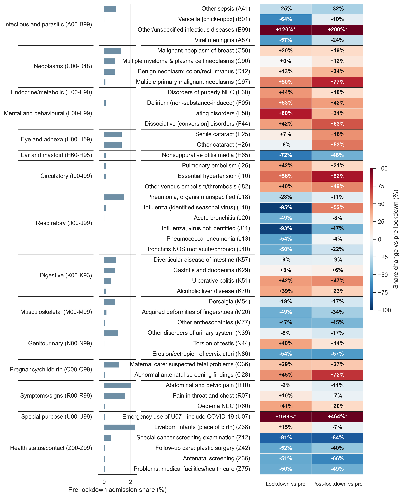

# Research Method Coursework 2

## NHS Primary Diagnosis Admissions - Uneven Lockdown Disruption and Post-lockdown Recovery

This repository contains the visualisation produced for Coursework 2, examining how NHS hospital admission patterns shifted across the COVID-19 lockdown period.

---

## Figure

### What the figure shows

The figure presents 45 primary diagnosis categories (ICD-10, 3-character codes), selected to represent the highest-burden conditions, the largest lockdown increases, and the largest lockdown decreases in admission share.

**Left panel — Pre-lockdown admission share (%)**  
A horizontal bar chart showing each diagnosis's share of total NHS admissions in the pre-lockdown baseline period (2017–2020). Wider bars indicate higher-burden conditions.

**Right heatmap — Change in admission share vs pre-lockdown (%)**  
Two columns show the percentage change in admission share relative to the pre-lockdown baseline:

| Column | Period |
|---|---|
| Lockdown | 2020-2022 |
| Post-lockdown | 2022-2024 |

- **Red** cells indicate an increase in admission share relative to baseline.
- **Blue** cells indicate a decrease.
- The colour scale is capped at ±100 %; values exceeding this are annotated with an asterisk (`*`) and their true value is shown in the cell.

Diagnoses are grouped and separated by ICD-10 chapter (left-hand labels), sorted by chapter and then by baseline share within each chapter.

---

## Repository contents

| Path | Description |
|---|---|
| `step1_data_process.py` | Cleans and standardises raw NHS Excel files into per-year CSVs |
| `step2_draw_figure.py` | Aggregates processed data and produces the figure |
| `config.py` | Shared configuration (paths, period mappings, figure parameters) |
| `f_vis/` | Output figure (PNG) |

> **Note:** Raw and processed data are not included in this repository.
